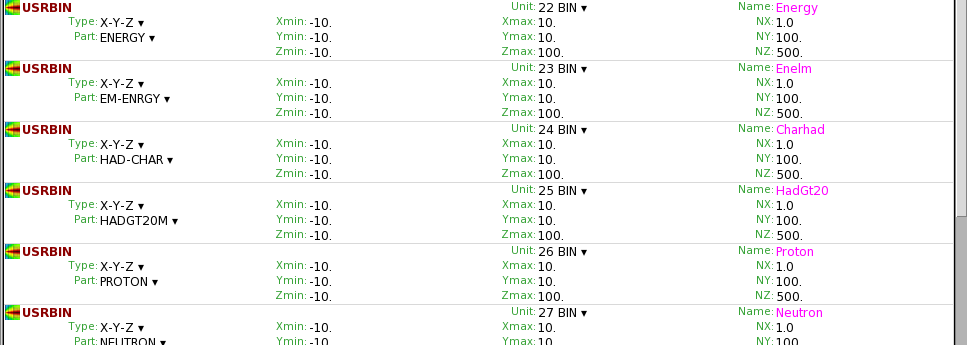

#### [HOME](https://agnieszkamucha.github.io/OPJzM/)
## Estymatory we Fluce
Obliczenia trasportu cząstek we Fluce umożliwiają wyznaczenie estymatorów szeregu parametrów, np. zdeponowanej energii, dawki, strumienia czy fluencji. Estymatory te obliczane są na kilka sposobów, szczegóły można znaleźć na stronie [FLUKI](http://www.fluka.org/fluka.php?id=man_onl).

### Metoda estymacji we FLUCE
to do later!

W naszych ćwiczeniach posłużymy się jednym z estymatorów: `USRBIN`. Pokazuje on np. depozyty energii w trójwymiarowej siatce, niezależnie od geometrii regionów. Fluka używa jednostek: cm, GeV.  
Użycie karty estymatora `USRBIN` wymaga:
- Wyboru współrzędnych - kartezjańskich, cylndrycznych, sferycznych.
- W zależności od rodzaju współrzędnych - podania ich zakresu (tu uwaga - zakres nie może być szerszy niż wymiary geometryczne całego obiektu).
- Wybrania parametru do estymacji. Jest tu cała lista, zachęcamy do testów. Najlepiej wpisać sobie kilka kart ze `USRBIN` z estymatorami różnych parametrów.
- Określenia numeru logicznego, najlepiej z rozwijanej listy, bo niektóre numery są zarezerwowane dla fortrana.
- Zdefiniowanie nazwy "detektora" - tak we Fluce nazywamy nasz estymator. Ta nazwa powinna być znacząca i może mieć do 8 znaków.
- Określenia liczby przedziałów (binów) każdej współrzędnej. Tutaj jest ograniczenie (na razie nie poznane), ale jeśli problem jest symetryczny w płaszczyźnie _xy_, to nie ma potrzeby dzielić np. osi _x_ (damy tam jeden przedział). Gestość podziału wybierzemy doświadczalnie, od tego zależy rozdzielczość naszej symulacji. Jeżeli będziemy badać zasięg promieniowania na odległości np. 1m, to rozsądnie jest podzielić ją na 500 binów.  Pamiętajmy o kropce dziesiętnej po każdej liczbie całkowitej!

Przykład definiowania `USRBIN`:

Rozkłady uzyskane po symulacji to kolorowe rozkłądy 3D, przede wszystkim powinniśmy wiedzieć, co się na nich znajduje. W naszych zastosowaniach wykorzystamy estymatory następujących zmiennych: _(dopisać opis)_
- `DOSE`
- `HAD_CHAR`
- `EM-ENERGY`
- `PROTON`, `NEUTRON`, `PHOTON`,  `ELECTRON`, `PIONS+-`, `MUONS`
- `SiMEVNE`
