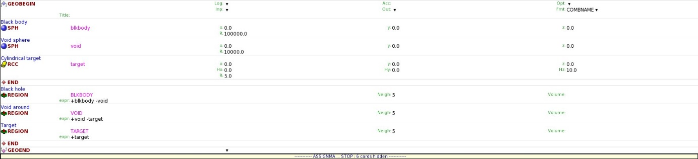

### [HOME OPJzM](https://agnieszkamucha.github.io/OPJzM/) 

FLUKA: | [START](https://agnieszkamucha.github.io/OPJzM/Start.md/) | [Primary](https://agnieszkamucha.github.io/OPJzM) | [Geometry](https://agnieszkamucha.github.io/OPJzM/Geometry.md) | [Estymatory](https://agnieszkamucha.github.io/OPJzM/Estymatory.md) | [Problemy](https://agnieszkamucha.github.io/OPJzM/Ratunek.md)
------------- |------------- | ------------ | ------------- | ------------ | -------------
VELO | ROOT | | | |
## Kategoria **GEOMETRYY**

Rozpoczynamy budowanie geometrii. Karta `GEOBEGIN` pozostaje niezmieniona. Szablon domyślnie generuje geometrię składającą się z dwóch olbrzymich koncentrycznych sfer o nazwach **blkbody** i **void** (obowiązkowe – nie usuwać, można zmienić im kształt) oraz tarczy cylindrycznej o nazwie `target`. 
Możemy zamienić tarczę na tarczę o innym kształcie poleceniem:
`Card → Change → Geometry → Bodies → Wybór kształtu`, lub dodać dodatkowy kształt geometryczny (dodać jego kartę) poleceniem:
`Card → Add → Geometry → Bodies → Wybór kształtu`. 
Dodawanie komentarza do karty: Kliknąć prawym przyciskiem myszy → Insert comment

## Przydatne kształty geometryczne:
kod |	opis
--------------------|---------------
RPP |	Prostopadłościan o krawędziach równoległych do osi układu współrzędnych, wyznaczony przez współrzędne: Xmin, Xmax, Ymin, Ymax, Zmin, Zmax
BOX	| Prostopadłościan o dowolnej orientacji w przestrzeni. Używanie kształtu BOX jest na ogół niezalecane. Można go zastąpić kombinacją płaszczyzn nieskończonych, PLA, XYP, XZP, YZP, które są łatwiejsze do zdefiniowania x, y, z: współrzędne wierzchołka
H1x, H1y, H1z: współrzędne wektora odpowiadającego wysokości 
H2x, H2y, H2z: współrzędne wektora odpowiadającego szerokości 
H3x, H3y, H3z: współrzędne wektora odpowiadającego długości 
Wektory 1, 2 i 3 muszą być wzajemnie prostopadłe.
SPH	| Sfera definiowana przez 4 liczby:
x, y, z: współrzędne środka
R: promień
RCC	| Walec kołowy prosty, o dowolnej orientacji w przestrzeni, definiowany przez 7 liczb:
x, y, z: współrzędne środka jednej z podstaw kołowych
Hx, Hy, Hz: współrzędne wektora odpowiadającego wysokości walca skierowanego ku drugiej podstawie
R: promień walca
REC	| Walec eliptyczny prosty, o dowolnej orientacji w przestrzeni, definiowany przez 12 liczb:
x, y, z: współrzędne środka jednej z podstaw eliptycznych
Hx, Hy, Hz: współrzędne wektora odpowiadającego wysokości walca skierowanego ku drugiej podstawie
R1x, R1y, R1z: odpowiednie półosi małe podstawy eliptycznej walca
R1x, R1y, R1z: odpowiednie półosi wielkie podstawy eliptycznej walca

Ważne jest, by poszczególne kształty (BODIES) nie dotykały się (nie posiadały wspólnych płaszczyzn)!
Definiowanie kształtów geometrycznych musi być zakończone kartą END.
