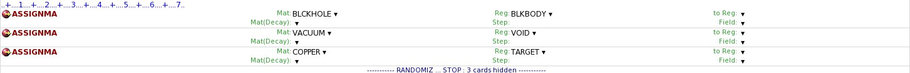
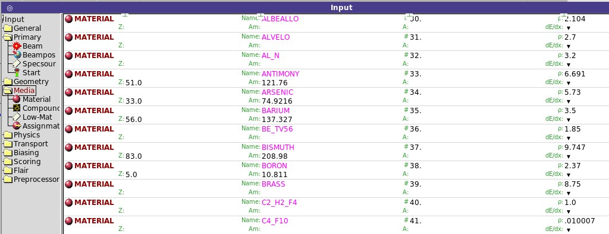
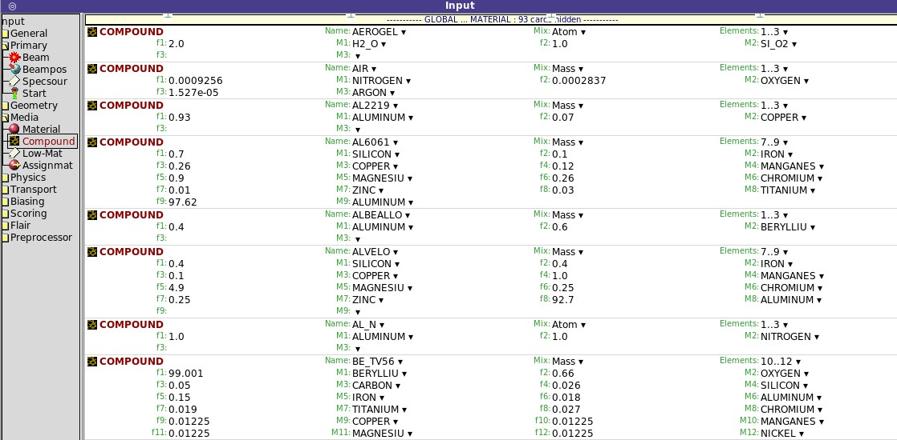



## Kategoria **MEDIA**

Czas, by utworzyć potrzebne materiały i przypisać je poszczególnym obszarom.
Można to zrobić na 2 sposoby:
- manualnie – tworząc niezbędne karty MATERIAL i COMPOUND bezpośrednio w edytorze pliku wsadowego;
- skorzystać z materiałów wstępnie zdefiniowanych w Bazie Danych Materiałów, a następnie zaimportować do edytora pliku wsadowego (zalecane). W bazie danych można tworzyć i zapisywać swoje własne materiały do wykorzystania w innych plikach wsadowych.

#### Manualne tworzenie materiału

Mając podświetloną kartę `GEOEND`, zastosować komendę
`Card → Add → Media → Material`.  
W przypadku związku lub mieszaniny dodatkowo zastosować kartę `COMPOUND`
`Card → Add → Media → Compound`

##### MATERIAL 
Definiuje materiał składający się z pojedynczego pierwiastka lub związek (konieczność sprzężenia z karta COMPOUND)

`WHAT(1)` **Name**: podać nazwę materiału lub w przypadku pierwiastka: **Z** liczbę atomową pierwiastka (znacząca w przypadkach, gdy karta `MATERIAL` nie jest sprzężona z kartą `COMPOUND`).
Brak wartości domyślnej
  
`WHAT(3)` **ρ**: gęstość wyrażona w g⁄〖cm〗^3.  
`WHAT(4)` #: wskaźnik (liczba) materiału. Podawać, o ile nie podano nazwy Name materiału.

WHAT(5) 
Am:
nr (nazwa) zamiennika materiału.

WHAT(6)
A:
Liczba masowa materiału.

SDUM 
dE/dx: strata energii na drogę.

##### COMPOUND 
Definiuje związek, stop lub mieszaninę materiałów (zdefiniowanych na kartach MATERIAL)

