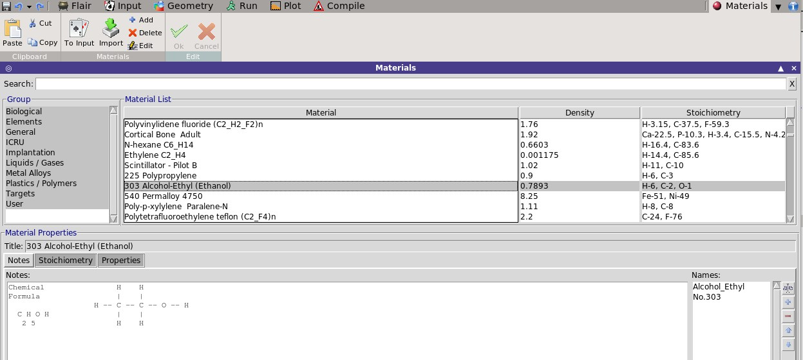
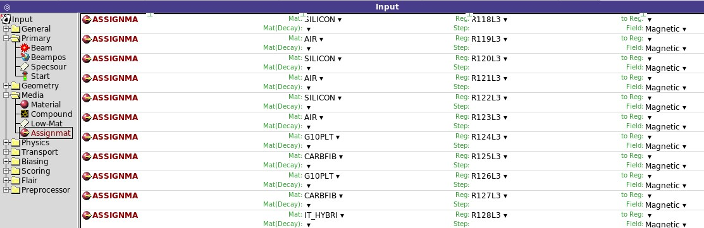



## Kategoria **MEDIA**

Czas, by utworzyć potrzebne materiały i przypisać je poszczególnym obszarom.
Można to zrobić na 2 sposoby:
- manualnie – tworząc niezbędne karty MATERIAL i COMPOUND bezpośrednio w edytorze pliku wsadowego;
- skorzystać z materiałów wstępnie zdefiniowanych w Bazie Danych Materiałów, a następnie zaimportować do edytora pliku wsadowego (zalecane). W bazie danych można tworzyć i zapisywać swoje własne materiały do wykorzystania w innych plikach wsadowych.

### Manualne tworzenie materiału

Mając podświetloną kartę `GEOEND`, zastosować komendę
`Card → Add → Media → Material`.  
W przypadku związku lub mieszaniny dodatkowo zastosować kartę `COMPOUND`
`Card → Add → Media → Compound`

### **MATERIAL** 
Definiuje materiał składający się z pojedynczego pierwiastka lub związek (konieczność sprzężenia z karta COMPOUND)

`WHAT(1)` **Name**: podać nazwę materiału lub w przypadku pierwiastka: **Z** liczbę atomową pierwiastka (znacząca w przypadkach, gdy karta `MATERIAL` nie jest sprzężona z kartą `COMPOUND`).
Brak wartości domyślnej
  
`WHAT(3)` **ρ**: gęstość wyrażona w g⁄〖cm〗^3.  
`WHAT(4)` `#`: wskaźnik (liczba) materiału. Podawać, o ile nie podano nazwy **Name** materiału.  
`WHAT(5)` **Am**: nr (nazwa) zamiennika materiału.  
`WHAT(6)` **A**: Liczba masowa materiału. 
`SDUM` **dE/dx**: strata energii na drogę.

### **COMPOUND** 
Definiuje związek, stop lub mieszaninę materiałów (zdefiniowanych na kartach MATERIAL)

Z listy rozwijanej wybrać **Mix**: typ mieszaniny (do wyboru Atom, Mass, Volume). W polu **Elements**: wybrać liczbę użytych materiałów.

`WHAT(1)`, `WHAT(3)`, `WHAT(5)` **M1, M2, M3**: podać nazwę materiału.
Brak wartości domyślnej.  
`WHAT(2)`, `WHAT(4)`, `WHAT(6)` **f1, f2, f3**: podać liczbę udziału materiału lub pierwiastka w mieszaninie wybranego typu (odpowiednio: liczba atomów danego pierwiastka w związku albo ułamek masowy lub objętościowy).   
`SDUM` **Name**: nazwa związku
Brak wartości domyślnej

## **Importowanie materiału z bazy danych**

Materiał zapisany w bazie danych można zaimportować poleceniem: `Card → Material`.
Wybrać i zaimportować żądany materiał. 

Można też przeglądać Bazę Danych Materiałów bezpośrednio. Nacisnąć strzałkę widoczną w prawym górnym rogu ekranu. Pojawi się lista rozwijana. 
Wybrać Materials. Wybrany materiał zaimportować poleceniem: `Materials → To input`
Możliwa jest tez procedura wprowadzenia do bazy danych
utworzonego przez siebie materiału z pliku INPUT: `Materials → Import`.

Na koniec należy jeszcze przypisać materiały do regionów. W tym celu należy zmodyfikować domyślne karty ASSIGNMA i dodać inne. Ważne, by każdy region miał przypisany materiał.

### **ASSIGNMA**  
Definiuje powiązanie danego materiału z obszarem (REGIONem), a także istnienie pól magnetycznych lub elektrycznych w danym obszarze.

`WHAT(1)` **Mat**: podać nazwę materiału.  
`WHAT(2)` **Reg**: podać dolną granicę zakresu regionów powiązanych z materiałem.  
`WHAT(3)` **to Reg**: podać górną granicę zakresu regionów powiązanych z materiałem. Wartość domyślna: to Reg = Reg .  
`WHAT(4)` **Step**: krok (liczba), dotyczy wskaźników regionów. Wartość domyślna: 1.0  
`WHAT(5)` **Field**: wybrać pole lub kombinację pól występujących w danym materiale.  
`WHAT(6)` **Mat(Decay)**: dotyczy przypadku transportu produktu radioaktywnego. Podać rozpad.  
`SDUM` Wartość nieużywana.
