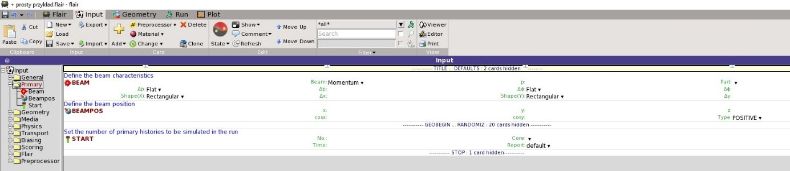
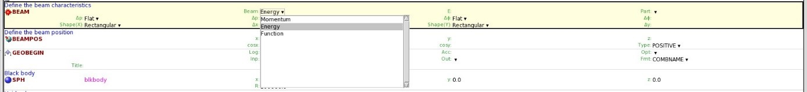

[OPJzM](https://agnieszkamucha.github.io/OPJzM/) | FLUKA: [START](https://agnieszkamucha.github.io/OPJzM/Start.md/) |
[Primary](https://agnieszkamucha.github.io/OPJzM) | [Geometry](https://agnieszkamucha.github.io/OPJzM/Geometry.md)
[Estymatory](https://agnieszkamucha.github.io/OPJzM/Estymatory.md) | [Problemy](https://agnieszkamucha.github.io/OPJzM/Ratunek.md)
------------ | ------------- | ------------ | ------------- | ------------ | -------------
## Kategoria **`PRIMARY`**
W niej definiowane są parametry żródła promienowania - rodzaj, pęd lub energię, kształt. Określamy również liczbę wychodzących czątek i _seed_ symulacji:

[](Images/primary.jpg)
```
BEAM - Definiuje wielkości charakteryzujące wiązkę: typ cząstek, energię lub pęd, rozbieżność i profil wiązki.
```

Poszczególne pola, w których definiuje się parametry źródła nazywane są we Fluce `What[N]` lub `SDUM`, `N` jest to numer parametru, w oryginalnym inpucie Fluki (bez Flaira) był to numer zarezerwowanego 8-znakowego pola, w którym umieszczało się liczbową lub znakową wartość parametru do symulacji. Obecnie Flair podpowiada w rozwijanej liście możliwe paramery i  możemy dokonać następujących ustaleń:

[](Images/beam.jpg)

`WHAT(1)` wybrać typ wiązki. Możliwość wyboru: Momentum (pęd) lub Energy (energia), (Function – nieaktywne) <br> 
- p: podać średni pęd cząstek wiązki (w GeV/c) <br>
- E: podać średnią energię cząstek wiązki (w GeV) <br>
Wartość domyślna dla pędu to 200.0 GeV/c  (?)

`WHAT(2)`	
- Δp: wybrać rozkład dla pędu. Możliwość wyboru: Flat (płaski) lub Gauss. Dla pędu zaleca się wybór rozkładu płaskiego (jednorodnego). <br>
- ΔE: wybrać rozkład dla energii Flat (płaski) lub Gauss.<br>
	- Flat Δp: podać niepewność pędu (w GeV/c).
	- Gauss Δp(FWHM): podać szerokość połówkową (FWHM = 2,355σ) rozkładu Gaussa. 
	
`What(3)`,  określa rozbieżność wiązki w mrad. 	
- Δφ: wybrać rozkład kątowy rozbieżności wiązki. Możliwość wyboru: Flat (płaski), Gauss lub Isotropic (izotropowy). 
	- Flat, Gauss- Δφ: podać wartość rozbieżności kątowej (od 0 do 1999).
	- Isotropic- oznacza rozbieżność wiązki >2π rad 

`WHAT(4)` `WHAT(5)`  określa szerokość wiązki w cm, odpowiednio dla współrzędnej `x` i `y`:	
- Shape(X), Shape(Y): wybrać kształt wiązki w kierunku X i Y. Możliwość wyboru: Rectangular (prostokątny), Annular (kątowy) lub Gauss. (Function – nieaktywne). 
	- Rectangular	Δx, Δy : podać szerokość wiązki w kierunku osi X i Y.
	- Annular	Rmin: podać minimalny promień wiązki o kształcie kątowym
	- Gauss		x(FWHM), y(FWHF): podać szerokość połówkową wiązki o kształcie gaussowskim w kierunku osi X i Y

`WHAT(6)` Wartość ignorowana

`SDUM` Part:	wybrać nazwę cząstek żródła lub wiązki:<br>
`4-HELIUM`:	cząstka alfa <br>
`RAY`	cząstka nierzeczywista, oznaczająca prostoliniową trajektorię, wykorzystywaną do skanowania geometrii<br>
`PROTON`	proton <br>
`ELECTRON`	elektron <br>
`PHOTON`	foton <br>
`NEUTRON`	neutron <br>
`BEAMPART`	cząstki bezpośrednie/wiązka padająca 

```
BEAMPOS - Definiuje położenie wiązki.  
```
Domyślnie (opcja BEAMPOS nie jest wymagana) wiązka wychodzi  z punktu `(0.,0.,0.)` i biegnie w dodatnim kierunku osi Z.<br>
Wartości `WHAT` zależą od wybranej wartości `SDUM`:<BR>
1. Dla SDUM = POSITIVE lub NEGATIVE:
- `WHAT(1)`, `WHAT(2)`, `WHAT(3)` : współrzędne `(x,y,z)` punktu źródłowego wiązki. 
- `WHAT(4)`, `WHAT(5)`: cosinusy kierunkowe wiązki względem osi X i Y. 
- `SDUM`: Type:	wybrać: 
	- NEGATIVE: cosinusy kierunkowe mają wartości ujemne (bieg wiązki w kierunku ujemnych wartości osi Z).	
	- POSITIVE: cosinusy kierunkowe mają wartości dodatnie (bieg wiązki w kierunku dodatnich wartości osi Z).	
2. Dla SDUM = SPHE-VOL: komenda definiuje przestrzenne źródło o kształcie powłoki sferycznej. Środek `(x,y,z)` zewnętrznej i wewnętrznej sfery, jak również kierunek biegu cząstek muszą być zdefiniowane przez dodatkową kartę `BEAMPOS`. Kątowy rozkład biegu cząstek (lub jego brak) jest definiowany na karcie `BEAM`.
- `WHAT(1)`: Rin: 
promień wewnętrznej sfery definiującej powłokę wyrażony w cm (wpisujemy wartość ≥ 0.0, wpisana wartość < 0.0 jest resetowana do wartości domyślnej= 0.).
- `WHAT(2)`: Rout: 
promień zewnętrznej sfery definiującej powłokę wyrażony w cm (wpisujemy wartość > 0.0, wpisana wartość 0.0 jest ignorowana, wartość < 0.0 jest resetowana do wartości domyślnej).
- `SDUM`  Type:	wybrać: `SPHE-VOL` 
3. Dla SDUM = CYLI-VOL: komenda definiuje przestrzenne źródło o kształcie powłoki cylindrycznej. Wysokości zarówno walca zewnętrznego, jak i wewnętrznego są równoległe do osi Z. Środek `(x,y,z)` zewnętrznego i wewnętrznego walca, jak również kierunek biegu cząstek muszą być zdefiniowane przez dodatkową kartę `BEAMPOS`. Kątowy rozkład biegu cząstek (lub jego brak) jest definiowany na karcie `BEAM`. 
- `WHAT(1)`: Rin: 
promień wewnętrznego walca definiującego powłokę wyrażony w cm (wpisujemy wartość ≥ 0.0, wpisana wartość mniejsza od 0.0 jest resetowana do wartości domyślnej 0.).	
- `WHAT(2)`: Rout: 
promień zewnętrznego walca definiującego powłokę wyrażony w cm (wpisujemy wartość > 0.0, wpisana wartość 0.0 jest ignorowana, wartość < 0.0 jest resetowana do wartości domyślnej).
- `WHAT(3)`: Hin: 
wysokość wewnętrznego walca definiującego powłokę wyrażony w cm (wpisujemy wartość ≥ 0.0, wpisana wartość mniejsza niż 0.0 jest resetowana do wartości domyślnej).	
- `WHAT(4)`: Hout: 
promień zewnętrznego walca definiującego powłokę wyrażony w cm (wpisujemy wartość > 0.0, wpisana wartość 0.0 jest ignorowana, wartość < 0.0 jest resetowana do wartości domyślnej).
Wartość domyślna 1.0
- `WHAT(5)` - `WHAT(6)` wartości nieużywane
- `SDUM` Type:	wybrać: `CYLI-VOL`.
4. Dla SDUM = CART-VOL: komenda definiuje przestrzenne źródło o kształcie powłoki kartezjańskiej. Krawędzie zewnętrzne i wewnętrzne są równoległe do odpowiednich osi `(X,Y,Z)`.  Środek `(x,y,z)` zewnętrznego i wewnętrznego prostopadłościanu, jak również kierunek biegu cząstek muszą być zdefiniowane przez dodatkową kartę `BEAMPOS`. Kątowy rozkład biegu cząstek (lub jego brak) jest definiowany na karcie `BEAM`.
- `WHAT(1)`, `WHAT(2)`, `WHAT(3)`, `WHAT(4)`, `WHAT(5)`, `WHAT(6)`: długości boków, odpowiednio: Xin- `x` wewnętrznego, Xout- `x` zewnętrznego i dalej Yin, Yout, Zin, Zout,  prostopadłościanu definiującego powłokę, wyrażona w cm (wpisujemy wartość > 0.0, wpisana wartość 0.0 jest ignorowana, wartość < 0.0 jest resetowana do wartości domyślnej = 1.).
- SDUM Type:	wybrać: CART-VOL.
5. Dla SDUM = FLOOD: komenda definiuje rozkład promieniowania na powierzchni sferycznej. Środek `(x,y,z)` , jak również kierunek biegu cząstek muszą być zdefiniowane przez dodatkową kartę `BEAMPOS` z wartością `SDUM = POSITIVE` lub `NEGATIVE`. `FLOOD` (WYPEŁNIENIE) oznacza sferyczną produkcję jednorodnej, izotropowej fluencji. Wartość fluencji Φ=1/(πR^2 ) cm^(-2).
- `WHAT(1)` R: 
promień sfery, do której weszły cząstki promieniowania, wyrażony w cm (wpisujemy wartość > 0.0, wpisana wartość 0.0 jest ignorowana, wartość < 0.0 jest resetowana do wartości domyślnej).
Wartość domyślna 1/√π cm (tj. fluencja Φ=1 cm^(-2))
- `WHAT(2) - WHAT(6)` wartości nieużywane
- `SDUM` Type:	wybrać: `FLOOD` 

```
START - Parametry startowe symulacji 
```
Ustala liczbę zdarzeń pierwotnych (PRIMARIES) wziętą do symulacji w pojedynczym uruchomieniu (RUN) programu. <br>
Tu wpisujemy jedynie wartość WHAT(1) (zaleca się rozpoczynanie pracy od liczby zdarzeń = 10000). Pozostałe wartości można pominąć.
- `WHAT(1)` No.: 
maksymalna liczba zdarzeń pierwotnych symulowanych w pojedynczym uruchomieniu.
Wartość domyślna 5000.0
- `WHAT(2)' wartość nieużywana
- `WHAT(3)` Time: 
czas pozostawiony do zakończenia symulacji wyrażony w s 
Wartość domyślna 80.0
- `WHAT(4)` Core: 
wykonywana (On) lub nie (Off) kopia jądra pamięci
- `WHAT(5) - WHAT(6)` wartości nieużywane
- `SDUM` Report: wybrać raportowanie: 
	- default: domyślnie
	- every history: każde zdarzenie


