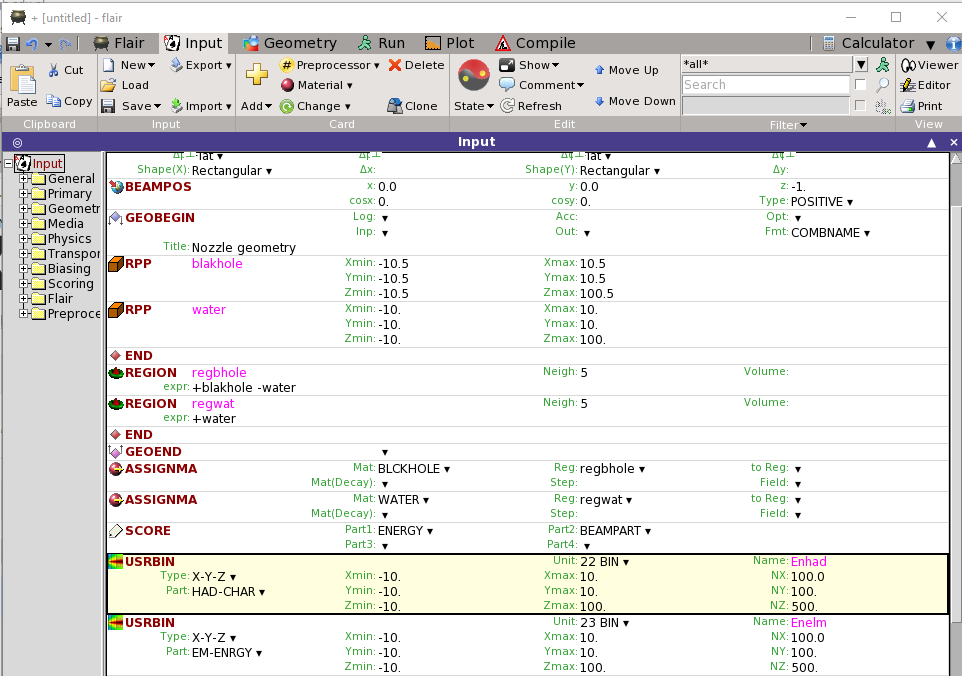

## Co to jest FLUKA?
FLUKA jest narzędziem ogólnego zastosowania, służącym do obliczeń transportu promieniowania i symulacji oddziaływania promieniowania z materią.
FLUKA jest historycznym programem do projektowania osłon w reaktorach jądrowych, ale obecnie symulacje promieniowania we FLUCE przeprowadzane są wszędzie, gdzie mamay doczynienia z dużymimi strumieniami, począwszy od przestrzeni kosmicznej, a skończywszy na Eksperymentach Fizyki Wysokich Energii, a zwłaszcza w przygotowywanym na 2023 roku programie High Lumininosity Large Hadron Collider. 
Może dziwić fakt, ale FLUKA napisana jest w języku Fortran, a użytkownik przeprowadza symulację wykorzystując przygotowane narzędzia, bez ingerencji w kod programu. Praca we Fluce odbywa się poprzez interfejs  FLAIR. Interfejs FLAIR ułatwia edycję plików wsadowych, uruchomienie kodu i wizualizację plików wynikowych. Napisany został w oparciu o standard Tkinter Pythona.

Zakres możliwości aplikacyjnych programu FLUKA obejmuje m. in. przyspieszanie wiązki protonów lub elektronów, projektowanie geometrii tarczy i zastosowanych osłon, obliczenia kalorymetryczne, dozymetryczne, projektowanie detektorów, planowanie radioterapii, itd.
FLUKA pomaga symulować z wysoką dokładnością oddziaływania i propagację promieniowania w materii, z wykorzystaniem 60 różnych cząstek oraz odpowiadających im antycząstek, a także neutronów o energiach do energii termicznych. Program może również symulować transport fotonów spolaryzowanych (np. promieniowanie synchrotronowe) oraz fotonów optycznych. FLUKA ma możliwość śledzenia cząstek naładowanych (także w obecności pól elektrycznych i magnetycznych). Szczegółowe informacje dotyczące programu FLUKA i FLAIR można znaleźć [tutaj](http://www.fluka.org/fluka.php).

## Jak rozpocząć pracę z programem FLUKA na WFiIS AGH? 
- Ze swojego konta na `taurusie` należy zalogować się na konto zespołu na serwerze `lhcb1`. Problem z kontem? Sprawdź [lhcb1](lhcb1.md).
- Na `lhcb` wykonać skrypt startowy:
```bash
$ source setlhcb
```
- Stworzyć i przejść do swojego katalogu roboczego:
- Uruchomić program FLAIR komendą:
```bash
$ flair &
```
Nasze pierwsze kroki postawimy robiąc symulację przejścia wiązki protonów przez beczkę z wodą.
W tym celu we Flairze wczytujemy przygotowany input `beczka.inp` klikając w przyciski: `Input->Load`
Widok na konsoli powinien wyglądąć tak:
[](Flair.png)
Zanim uruchomimy symulację, popatrzymy na strukturę wczytanego pliku.

## Moja pierwsza symulacja
Praca w programie FLUKA polega na tworzeniu plików wsadowych (INPUT).
Plik wsadowy INPUT jest tworzony w standardzie ASCII z rozszerzeniem `.inp` .
Plik INPUT składa się z komend (opcji), każda z nich zawiera jedną lub więcej linii (z przyczyn historycznych nazywanych „kartami”). Poza komendami FLUKI plik wsadowy powinien także zawierać opis geometrii projektowanej symulacji.
Typowa struktura pliku INPUT:
- tytuły i komentarze,
- opis geometrii (bryły przestrzenne i powierzchnie, w połączeniu z przestrzenią podzieloną na regiony (obowiązkowe),
-	definicje materiałów (obowiązkowe, za wyjątkiem materiałów wstępnie zdefiniowanych w programie),
-	przypisanie materiałów do danych regionów (obowiązkowe),
-	definicje potrzebnych detektorów, 
Detektor jest to region, w którym użytkownik chce obliczać wartości oczekiwane wielkości fizycznych, takich jak energia zdeponowana, dawka, fluencja, itp. Dostępne są różne typy detektorów odpowiadające różnym wielkościom i różnym algorytmom zastosowanym do oszacowania tych wartości (estymatory). Wybór detektorów jest opcjonalny, jednak należy wybrać przynajmniej jeden.
-	definicje źródeł cząstek (obowiązkowe),
-	zdefiniowane ustawienia charakteryzujące problem, czyli np. wartości graniczne energii, efekty fizyczne nie symulowane domyślnie, cząstki wyłączone z transportu, itp.  (opcjonalne),
-	inicjalizacja losowej sekwencji liczbowej (obowiązkowe, jeśli wymagane jest oszacowanie błędu statystycznego),
-	sygnał startowy i liczba żądanych zdarzeń (obowiązkowe).
 
# Tworzenie pliku inputowego
Po lewej stronie okna Flaira znajduje się drzewo projektu. Widoczne są w nim następujące kategorie kart:


