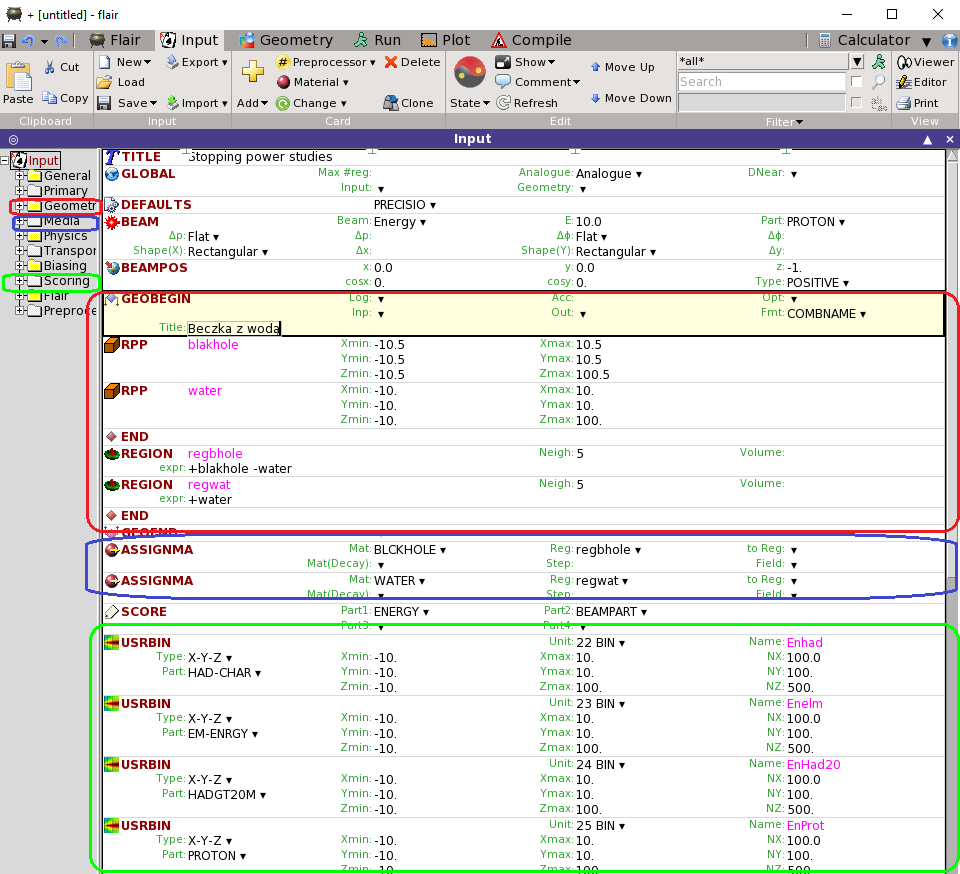
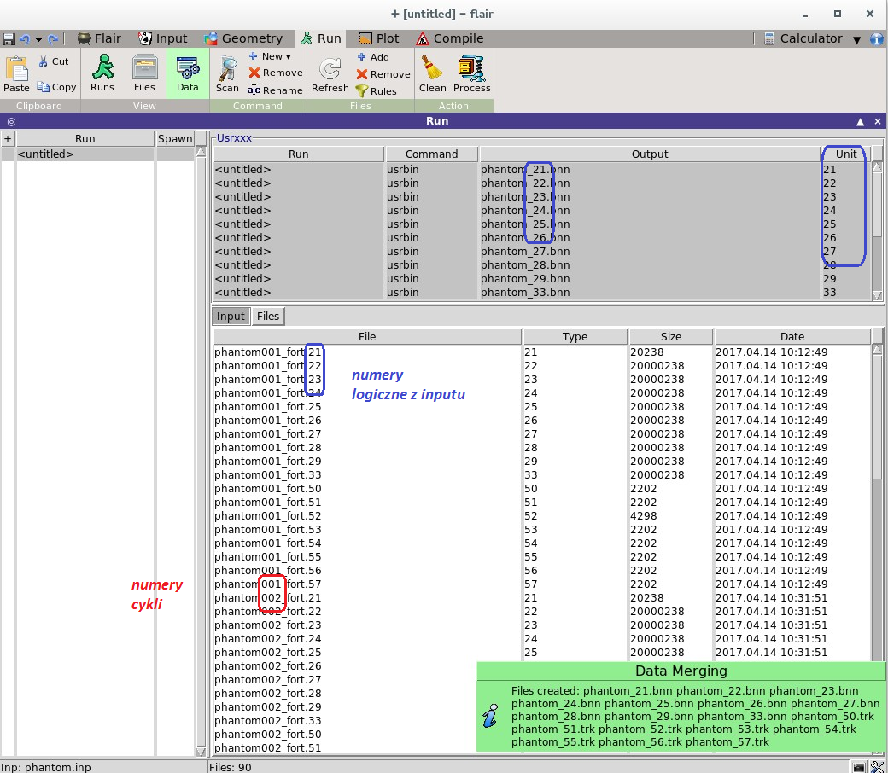
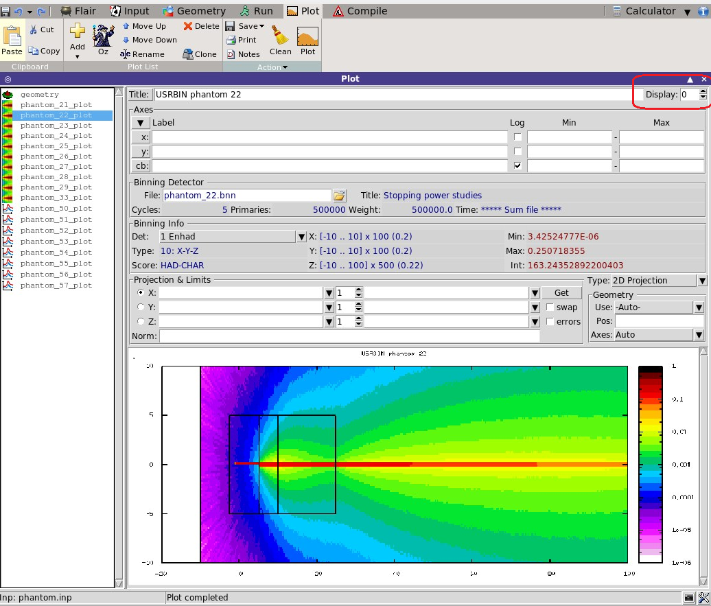

## Co to jest FLUKA?
FLUKA jest narzędziem ogólnego zastosowania, służącym do obliczeń transportu promieniowania i symulacji oddziaływania promieniowania z materią.
FLUKA jest historycznym programem do projektowania osłon w reaktorach jądrowych, ale obecnie symulacje promieniowania we FLUCE przeprowadzane są wszędzie, gdzie mamay doczynienia z dużymimi strumieniami, począwszy od przestrzeni kosmicznej, a skończywszy na Eksperymentach Fizyki Wysokich Energii, a zwłaszcza w przygotowywanym na 2023 roku programie High Lumininosity Large Hadron Collider. 
Może dziwić fakt, ale FLUKA napisana jest w języku Fortran, a użytkownik przeprowadza symulację wykorzystując przygotowane narzędzia, bez ingerencji w kod programu. Praca we Fluce odbywa się poprzez interfejs  FLAIR. Interfejs FLAIR ułatwia edycję plików wsadowych, uruchomienie kodu i wizualizację plików wynikowych. Napisany został w oparciu o standard Tkinter Pythona.

Zakres możliwości aplikacyjnych programu FLUKA obejmuje m. in. przyspieszanie wiązki protonów lub elektronów, projektowanie geometrii tarczy i zastosowanych osłon, obliczenia kalorymetryczne, dozymetryczne, projektowanie detektorów, planowanie radioterapii, itd.
FLUKA pomaga symulować z wysoką dokładnością oddziaływania i propagację promieniowania w materii, z wykorzystaniem 60 różnych cząstek oraz odpowiadających im antycząstek, a także neutronów o energiach do energii termicznych. Program może również symulować transport fotonów spolaryzowanych (np. promieniowanie synchrotronowe) oraz fotonów optycznych. FLUKA ma możliwość śledzenia cząstek naładowanych (także w obecności pól elektrycznych i magnetycznych). Szczegółowe informacje dotyczące programu FLUKA i FLAIR można znaleźć [tutaj](http://www.fluka.org/fluka.php). <br>
Przykad możliwości Fluki można zobaczyć poniżej. Na rysunkach przedstawiono oddziaływanie wiązki protonów o energii 10 GeV z wodą  i krzemowym sensorem oraz dawkę promieniowania zdeponowaną w materiale spektrometru LHCb.

[](Images/PR.png)

## Jak rozpocząć pracę z programem FLUKA na WFiIS AGH? 
- Ze swojego konta na `taurusie` należy zalogować się na konto zespołu na serwerze `lhcb1`. Problem z kontem? Sprawdź [lhcb1](lhcb1.md).
- Na `lhcb` wykonać skrypt startowy:
```bash
$ source setlhcb
```
- Stworzyć i przejść do swojego katalogu roboczego:
- Uruchomić program FLAIR komendą:
```bash
$ flair &
```
Nasze pierwsze kroki postawimy robiąc symulację przejścia wiązki protonów przez beczkę z wodą.
W tym celu we Flairze wczytujemy przygotowany input `beczka.inp` klikając w przyciski: `Input->Load`
Widok na konsoli powinien wyglądąć tak:

[](Images/Flair.png)

Zanim uruchomimy symulację, popatrzymy na strukturę wczytanego pliku:

## Moja pierwsza symulacja
Praca w programie FLUKA polega na tworzeniu plików wsadowych (INPUT). Można go edytować w dowolnym edytorze, ale znacznie wygodniej używać do tego Flaira. Flar umożliwia stworzenie nowego pliku na podstawie wbudowanych szablonów konkretnych procesów `basic, decay, no geometry, itp` porzez:
```
Input->New->basic
```
W ten sposób dostajemy podpowiedź, z czego powinien się składać plik inputowy i możemy go dostosować do własnego problemu.

Plik wsadowy INPUT jest tworzony w standardzie ASCII z rozszerzeniem `.inp` .
Plik INPUT składa się z komend (opcji), każda z nich zawiera jedną lub więcej linii (z przyczyn historycznych nazywanych „kartami”). Poza komendami FLUKI plik wsadowy powinien także zawierać opis geometrii projektowanej symulacji.
Typowa struktura pliku INPUT:
- tytuły i komentarze,
- opis geometrii (bryły przestrzenne i powierzchnie, w połączeniu z przestrzenią podzieloną na regiony (obowiązkowe),
-	definicje materiałów (obowiązkowe, za wyjątkiem materiałów wstępnie zdefiniowanych w programie),
-	przypisanie materiałów do danych regionów (obowiązkowe),
-	definicje potrzebnych detektorów, 
Detektor jest to region, w którym użytkownik chce obliczać wartości oczekiwane wielkości fizycznych, takich jak energia zdeponowana, dawka, fluencja, itp. Dostępne są różne typy detektorów odpowiadające różnym wielkościom i różnym algorytmom zastosowanym do oszacowania tych wartości (estymatory). Wybór detektorów jest opcjonalny, jednak należy wybrać przynajmniej jeden.
-	definicje źródeł cząstek (obowiązkowe),
-	zdefiniowane ustawienia charakteryzujące problem, czyli np. wartości graniczne energii, efekty fizyczne nie symulowane domyślnie, cząstki wyłączone z transportu, itp.  (opcjonalne),
-	inicjalizacja losowej sekwencji liczbowej (obowiązkowe, jeśli wymagane jest oszacowanie błędu statystycznego),
-	sygnał startowy i liczba żądanych zdarzeń (obowiązkowe).
 
## Tworzenie pliku inputowego
Po lewej stronie okna Flaira znajduje się drzewo projektu. Widoczne są w nim następujące kategorie kart:
- `General`:	karty ogólne (TITTLE, DEFAULTS, GLOBAL, …). Mają wprowadzone wartości domyślne. Jeśli nie – można wpisać tytuł.
- `Primary`:	karty z opisem wiązki i cząstek pierwotnych (tzw. _primaries_). Tutaj zdefiniujemy parametry źródła promieniowania - typ, kształt, pęd, energię, rozmycie. Określimy rodzaj - fotony, protony, itd. Określamy też liczbę cząstek pierwotnych, liczba ta ma ogromny wpływ na czas wykonania zadania.
- `Geometry`:	karty z opisem geometrii, regionów, w któych badamy promieniowanie. To jedna z najważniejszych kategorii - z dostępnych figur geometrycznych (kula, sfera, prostopadłościan, walec, płaszczyzny, i.in.), wykorzystując logiczne operatory sumowania, odejmowania, budujemy naszą rzeczywistość - detektor, osłony, człowieka, itp.
- `Media`:	karty definiujące zastosowane materiały. Tutaj określamy, z czego składają się zbudowane powyżej obiekty - można wykorzystać bazę ze zdefinowanymi we Fluce materiałami (woda, miedź, powietrze, itp), można stworzyć swój składnik podając skład chemiczny (np. papier).
- `Physics`:	karty definiujące właściwości fizyczne dotyczące danej symulacji.
- `Transport`:	karty, które zmieniają sposób transportu cząstek w programie FLUKA.
- `Biasing:`	karty definiujące obciążenie estymatorów. W tych trzech ostatnich kartach można podać modele fizyczne oddziaływań, które chcemy, aby znalazły się w transporcie cząstek. Domyślnie Fluka używa aktualnych modeli i teorii, można to zmienić w wyjątkowych zastosowaniach, ale na początku lepiej tu nic nie zmieniać, o fizykę we Fluce dbają znakomici naukowcy z różnych dziedzin, zajmujący się fizyką w BAAARDZO szerokim zakresie energetycznym.
- `Scoring`:	karty definiujące zakres i rodzaj estymatorów. Jest to druga najważniejsza kategoria - definiujemy, jakich wyników (estymatorów parametrów fizycznych) oczekujemy od Fluki. Bardzo dużo możliwości - od depozytów energii do strumieni i fluencji cząstek. W następnym paragrafie opisane zostaną  najbardziej dla nas użystecznych estymatory. 

Poszczególne karty można traktować jak pojedyncze obiekty. Można je kasować, wstawiać, kopiować, wklejać, klonować, … Pozycja karty nie ma większego znaczenia. FLAIR stara się reorganizować plik Input podczas zapisywania i przesuwa karty na odpowiednie pozycje. Karty z kategorii Geometry, powinny się znaleźć w bloku GEOBEGIN .. GEOEND.
Aby rozpocząć edycję karty, należy wybrać kartę za pomocą strzałek góra/dół lub za pomocą myszy. Karta aktywna ma podświetlone tło w jasnożółtym kolorze i czarną obramówkę. Można "podświetlić" kilka (takich samych) kart i wtedy zmienimy wszystkie karty (uwaga, żeby nie zmienić nazw estymatorów). Uwaga! We Flairze ZAWSZE trzeba wpisywać liczby z kropką na końcu, np. `100.`, nawet liczby całkowite! To pozostałość po fortranie...

### STOP
Tutaj proponujemy się zatrzymać i poeksperymentować. Zadanie na pierwsze ćwiczenia laboratoryjne polega na stworzeniu pliku inputowego, otrzymaniu kilku (pięciu) rozkładów i dyskusji wyników. 

### Błędy w pliku inputowym
Najpierw trzeba sprawdzić, czy Flair sam nie znalazł błędu - zmieni kolor czcionki na czerwono (trzeba poprawić!), czasem pojawi się czerwonawe okienko sygnalizujące `Error`. Ale przeważnie błąd zauważymy w momencie wykonania symulacji, albo dopiero po - gdy oglądniemy wyniki. W sytuacjach kryzysowych, zanim rzucisz klawiaturą, spojrzyj na: [Pomocy!](Ratunek.md) Fluka ma swoje ograniczenia, czasem pochodzące z fortrana, ale czasem równieź z Gnuplota, którego używa do tworzenia wykresów.

## Wykonanie symulacji
Po stworzeniu pliku inputowego puszczany symulację klikając:
```
Run->Runs->Start
```
Można zuważyć, że zadanie wykonuje się w tzw. cyklach - im większa liczba cykli, tym mniejsze niepewności statystyczne. Podczas wykonania możemy śledzić status zadania:
[](Images/Flair_run.jpg)
Po uzyskaniu wiadomości `Finished OK` możemy oglądnąć wyniki. Jeśli dostaniemy cokolwiek innego, np: `TIMEOUT` - mamy błąd w pliku inputowym (najczęściej: za dużo przedziałów w rozkładach 3D, brak kropki po liczbie całkowitej, niezdefiniowany materiał, region, itp). Wracamy do `Input` i zaczynamy analizę  pliku. Może się tu zdarzyć, że `TIMEOUT` ma przyczynę systemową - brak biblioteki. Staramy się to sprawdzać, ale historia nas nauczyła, że takie zdarzenia pojawiają się nieczekiwanie. 

Gdy jest `Finished OK`, kliknijmy na: `Run->Files` - zobaczymy pliki outputowe. Widać w nazwach numery _jednostek logicznych_, które zdefiniowaliśmy w pliku inputowym, zauważymy również, że Fluka zapisała wyniki OSOBNO dla każdego cyklu. Jest to pozostałość po zamierzchłych czasach, kiedy komputery liczyły wolno i często się zawieszały - w takiej sytuacji można było wykorzystać fragment skończonej symulacji. Po zastanowieniu wydaje się to logiczne. 

Musimy teraz połączyć wyniki. W tym celu klikamy `Run->Data->Process` i czekamy na zielone okienko informujące, ile i jakie pliki outputowe są łączone. Widok powinien być taki:

[](Images/Flair_megre.png)

### Błędy
Możemy dostać tutaj  czerwonawe okienko z `Errors` zmiast zielonego z sukcesem `Data merging`. Błędy na tym etapie spowodowane są błędami w geometrii - np. obszar do `Scoringu` wykracza poza region w `Geometry` albo regiony są źle nazwane lub zdefinowane, albo coś jest źle z zakresami rozkładów. Musimy to znaleźć sami i puścić symulację od nowa. Może tutaj pojawić się błąd z `Gnuplota` - np, że ma za małą paletę barw. wtedy należy zainstalować jego inną wersję. Może się również zdarzyć, że brakuje danych na rozkładzie - wtedy Gnuplot nie ma co wyświetlić. W tej sytuacji po prostu zwiększamy liczbę `Primaries`. 

## Wykonanie rozkładów
Uff, już niedługo... <br> Klikamy `Plot->Oz` i widzimy listę stworzonych przez nas rozkładów. Feel free to click! Prosżę teraz przyjrzeć się informacjom wypisanycm we Flairze i przetestować wszystkie możliwe przyciski!

[](Images/Flair_plot.png)


### Wskazówki praktyczne
- Kilka rysunków na jednej konsoli można zrobić zwiększająć licznk w przycisku `Display`.
- Jeśli chcemy zrobić rozkłady w NOWEJ sesji Flaira, wczytujemy plik inputowy: `Input->Load`, a potem musimy połaczyć dane `Run->Data->Process` i zrobić rysunki: `Plot->Oz`.

## Dyskusja wyników
Dzisiejsze laboratorium skończymy, gdy KAŻDY dostanie rozkłady i omówi je z prowadzącym. 

# Dla dociekliwych
Proszę oglądnąć (w edytorze lub Flairze) pliki z wynikami. Co w nich jest? Jakie informacje? Jak zapisane? Czy po "wyklikaniu" rysunków nie mamy ochoty zrobić ich w innym programie? Zapraszamy zatem do konwersji wyników Fluki do ROOTa [FLOOT](FLOOT.md)... 


