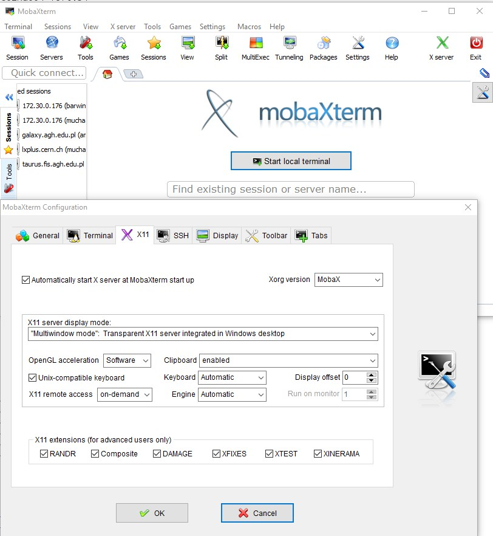



## Serwer lhcbd1

Aplikacja ROOT jest dostępna na naszym grupowym serwerze, fizycznie znajdującym się w budynku D10. Można dostać się na niego np. z wydziałowego `taurusa`, używając darmowej aplikacji `MobaXterm` lub z dowolnego terminala w systemie linux lub VM. 
Używając MobaXterm, proszę zwrócić uwagę, czy w ustawieniach tej aplikacji aktywna jest opcja otwierania X terminala:

[](Images/moba.jpg)

Po uruchomieniu `MobaXterm` startujemy sesję ssh: `Sessions->SSH`. W oknie `Remote host` wpisujemy: `taurus.fis.agh.edu.pl`.
Dalej już postępuje się tak samo niezależnie, czy mamy okno z linuxa, czy z Moby:  logujemy na konto swojego zespołu:
```
ssh -XY CEO_2021_NN@lhcbd1
```
Nazwy kont to: `CEO_2021_NN@lhcbd1`, gdzie NN- oznacza numer studenta. Dane do logowania zamieszczone są w materiałach na Teamsach. Prosze zauważyć, że przy wpisywaniu hasła kursor jest niewidoczny. 

Po zalogowaniu się swoje konto aktywujemy środowisko:
```
conda activate env-analysis-uproot
```
Dostępny jest ROOT v6.22 z python3 oraz `jupyter notebook`. <br>
Dane do ćwiczenia dostępne są z katalogu (proszę nie kopiować danych do swojego domowego katalogu):
```
/data4/ceo-data
```
## Uwaga!
Konto na serwerze `lhcbd1` jest przeznaczone tylko na cele dydaktyczne dla analiz dotyczących oddziaływania promieniowania z materią i fizyki cząstek elementarnych. Inne użycie jest niedozwolone! 
